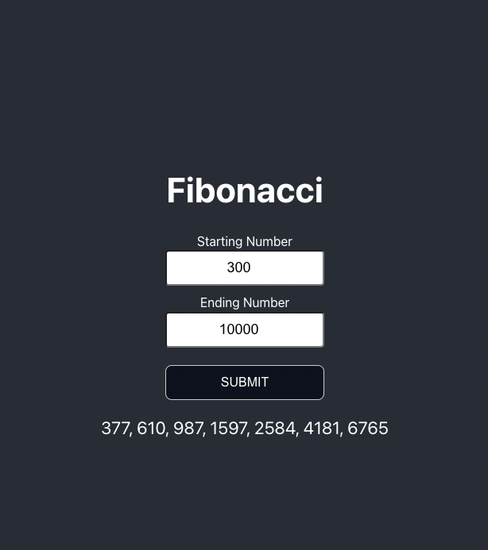

# Fibonacci Form
This app has a form with two inputs.
The two inputs take two numbers and outputs the fibonacci sequence between these two numbers.
Created with create-react-app and express for api.
## To Run Locally
```
git clone https://github.com/moitorrijos/fibonacci
cd fibonacci
npm i

cd client
npm i

cd ..
npm start
```